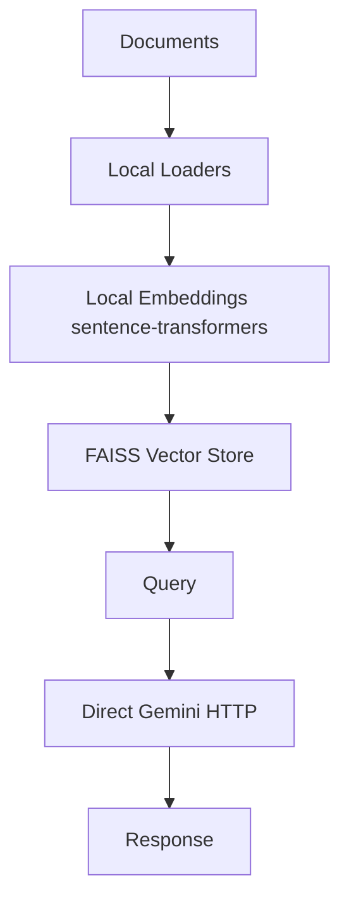
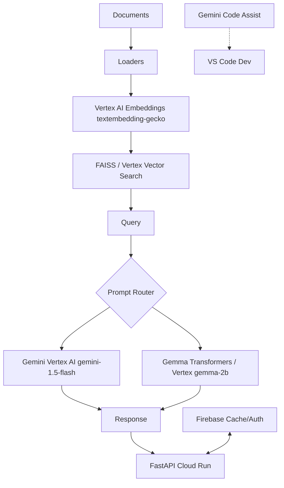

# Adapting Hackrx6.0 RAG System to Google Cloud AI Prototype

## Overview

This document outlines the changes required to adapt the existing Hackrx6.0 project—a Retrieval-Augmented Generation (RAG) system built with FastAPI, local embeddings (sentence-transformers/all-MiniLM-L6-v2), FAISS for vector storage, and direct HTTP calls to the Gemini API—into a scalable prototype using Google Cloud's AI tools: Gemma, Gemini, Vertex AI, and Gemini Code Assist.

The goal is to create a production-ready prototype eligible for expert mentorship from Google Cloud practitioners and Gen AI specialists. The core RAG pipeline (document loading, chunking, retrieval, and generation) remains intact but becomes cloud-native for better scalability, monitoring, and integration.

### Current Project Snapshot
- **AI Components**: Local embeddings, direct Gemini API calls via `generativelanguage.googleapis.com`.
- **Dependencies**: FastAPI, torch, sentence-transformers, langchain, httpx.
- **Deployment**: Local CPU-optimized (MacBook), no cloud integration.
- **Key Files**: `src/ai/gemini_client.py` (HTTP-based), `src/core/config.py` (API keys), `requirements.txt`.

### Proposed Enhancements
- **Gemini via Vertex AI**: Managed endpoints for scalability and advanced features.
- **Gemma**: Lightweight models for efficient inference.
- **Vertex AI**: Centralized AI operations (LLM, embeddings).
- **Gemini Code Assist**: Development tool for code quality.

### Tool Usage Breakdown
This prototype leverages specific Google Cloud tools for different aspects:

- **Vertex AI**: Core AI platform for model serving, embeddings, and generation. Used for:
  - Hosting Gemini models (text/vision generation) with managed scaling and monitoring.
  - Text embeddings (textembedding-gecko@001) to replace local sentence-transformers, enabling hybrid RAG retrieval.
  - Experiment tracking and metrics logging for prototype evaluation.
  - Integration: SDK calls in `gemini_client.py` and `vertex_embeddings.py`.

- **Cloud Run**: Serverless deployment for the FastAPI app. Handles:
  - Automatic scaling for API endpoints (e.g., /chat for RAG queries).
  - Containerized deployment without managing infrastructure.
  - Integration: Deploy via `gcloud run deploy` using `deploy.yaml`.

- **Firebase**: For authentication, real-time database, storage, and caching. Enhances the prototype by:
  - Adding user auth for secure API access (Firebase Auth).
  - Storing/retrieving documents in Cloud Storage with Firebase SDK.
  - Real-time query updates via Firestore.
  - Caching embeddings/responses in Firestore for persistence across instances (replaces local cache_dir).
  - Integration: Add `firebase-admin` to requirements.txt; use in `src/utils/cache_manager.py` for cloud caching. Enable in Google Cloud console under Firebase (create project or link to existing).

- **Gemini Code Assist**: IDE tool for development. Used during refactoring:
  - Code completion, explanations, and bug fixes in VS Code.
  - Not runtime-integrated but essential for building/maintaining the prototype.

- **Other Tools (Optional)**: Cloud Build for CI/CD, Cloud Storage for document uploads, BigQuery for logging analytics.

These tools ensure a full-stack Google Cloud prototype, showcasing ecosystem integration.

## Prerequisites and Setup

1. **Google Cloud Project**:
   - Create a project at [console.cloud.google.com](https://console.cloud.google.com).
   - Enable APIs: Vertex AI API, Generative Language API.

2. **Install Google Cloud CLI** (macOS):
   ```
   brew install google-cloud-sdk
   gcloud auth application-default login
   ```

3. **Environment Updates**:
   - Add to `.env`:
     ```
     GOOGLE_CLOUD_PROJECT_ID=your-project-id
     ```
   - Remove or deprecate `GEMINI_API_KEY` for Vertex AI (uses OAuth2 via ADC).
   - Update [src/core/config.py](src/core/config.py:23):
     ```python
     @dataclass
     class APIConfig:
         # ...
         project_id: str = os.getenv("GOOGLE_CLOUD_PROJECT_ID", "")
         gemini_url: str = f"https://us-central1-aiplatform.googleapis.com/v1/projects/{{project_id}}/locations/us-central1/publishers/google/models/"
     ```

## Key Changes and Migrations

### 1. Update Dependencies (requirements.txt)
Add Google Cloud SDKs and Gemma support. Edit [requirements.txt](requirements.txt:1):

```
# Google Cloud AI
google-cloud-aiplatform>=1.38.0
google-generativeai>=0.7.2  # Fallback for direct Gemini

# Firebase
firebase-admin>=6.5.0

# Gemma Support
accelerate  # For efficient loading

# Embeddings (migrate to Vertex; keep local for hybrid)
# sentence-transformers  # Optional now

# Existing: fastapi, langchain, faiss-cpu, etc.
```

Run `pip install -r requirements.txt`.

### 2. Refactor Gemini Client for Vertex AI
Replace raw HTTP in [src/ai/gemini_client.py](src/ai/gemini_client.py:9) with Vertex AI SDK.

Updated class:
```python
# src/ai/gemini_client.py (refactored)
from google.cloud import aiplatform
from vertexai.generative_models import GenerativeModel, GenerationConfig, HarmCategory, HarmBlockThreshold
from ..core.config import config
import base64
import httpx

class GeminiClient:
    def __init__(self):
        project_id = config.api.project_id
        aiplatform.init(project=project_id, location="us-central1")
        self.model_name = config.models.llm_model  # e.g., "gemini-1.5-flash"
        self.model = GenerativeModel(self.model_name)
        self.generation_config = GenerationConfig(
            temperature=0.3,
            max_output_tokens=2048,
            top_p=0.9,
            top_k=40
        )
        self.safety_settings = [
            {"category": HarmCategory.HARM_CATEGORY_HARASSMENT, "threshold": HarmBlockThreshold.BLOCK_NONE},
            {"category": HarmCategory.HARM_CATEGORY_HATE_SPEECH, "threshold": HarmBlockThreshold.BLOCK_NONE},
            {"category": HarmCategory.HARM_CATEGORY_SEXUALLY_EXPLICIT, "threshold": HarmBlockThreshold.BLOCK_NONE},
            {"category": HarmCategory.HARM_CATEGORY_DANGEROUS_CONTENT, "threshold": HarmBlockThreshold.BLOCK_NONE}
        ]

    async def generate_text(self, prompt: str, system_prompt: str = "", model: str = None) -> str:
        full_prompt = f"{system_prompt}\n\n{prompt}" if system_prompt else prompt
        try:
            response = self.model.generate_content(
                full_prompt,
                generation_config=self.generation_config,
                safety_settings=self.safety_settings
            )
            if response.candidates:
                candidate = response.candidates[0]
                if candidate.finish_reason.name == "SAFETY":
                    return "Content blocked by safety filters."
                return candidate.content.parts[0].text
            return "No content generated."
        except Exception as e:
            return f"Vertex AI Error: {str(e)}"

    async def analyze_image(self, image_url: str, prompt: str, system_prompt: str = "") -> str:
        full_prompt = f"{system_prompt}\n\n{prompt}" if system_prompt else prompt
        try:
            async with httpx.AsyncClient() as client:
                img_response = await client.get(image_url, timeout=30)
                img_response.raise_for_status()
                image_data = base64.b64encode(img_response.content).decode()
                mime_type = "image/jpeg"  # Detect as before
                if image_url.lower().endswith('.png'):
                    mime_type = "image/png"
                elif image_url.lower().endswith('.webp'):
                    mime_type = "image/webp"

            response = self.model.generate_content(
                [full_prompt, {"mime_type": mime_type, "data": image_data}],
                generation_config=self.generation_config,
                safety_settings=self.safety_settings
            )
            if response.candidates:
                return response.candidates[0].content.parts[0].text
            return "Unable to analyze image."
        except Exception as e:
            return f"Error analyzing image: {str(e)}"

gemini_client = GeminiClient()

async def generate_text_with_gemini(prompt: str, system_prompt: str = "", model: str = None) -> str:
    return await gemini_client.generate_text(prompt, system_prompt, model)

async def analyze_image_with_gemini(image_url: str, prompt: str, system_prompt: str = "") -> str:
    return await gemini_client.analyze_image(image_url, prompt, system_prompt)
```

Update [src/core/config.py](src/core/config.py:39):
```python
@dataclass
class ModelConfig:
    # ...
    llm_model: str = "gemini-1.5-flash"  # Vertex format: "gemini-1.5-flash"
    llm_vision_model: str = "gemini-1.5-flash"
```

### 3. Integrate Gemma Models
Create new file [src/ai/gemma_client.py](src/ai/gemma_client.py):
```python
# src/ai/gemma_client.py
from transformers import AutoTokenizer, AutoModelForCausalLM
import torch
from ..core.config import config

class GemmaClient:
    def __init__(self, model_name: str = None):
        self.model_name = model_name or config.models.gemma_model  # Add to ModelConfig: gemma_model = "google/gemma-2b"
        self.tokenizer = AutoTokenizer.from_pretrained(self.model_name)
        self.model = AutoModelForCausalLM.from_pretrained(
            self.model_name,
            torch_dtype=torch.float16,
            device_map="cpu"  # CPU for local
        )

    def generate(self, prompt: str, max_length: int = 512, temperature: float = 0.3) -> str:
        inputs = self.tokenizer(prompt, return_tensors="pt")
        with torch.no_grad():
            outputs = self.model.generate(
                **inputs,
                max_length=max_length,
                temperature=temperature,
                do_sample=True,
                pad_token_id=self.tokenizer.eos_token_id
            )
        return self.tokenizer.decode(outputs[0], skip_special_tokens=True)

gemma_client = GemmaClient()

def generate_with_gemma(prompt: str) -> str:
    return gemma_client.generate(prompt)
```

- In RAG pipeline (e.g., [src/api/endpoints.py](src/api/endpoints.py)), route simple queries to Gemma:
  ```python
  if len(prompt) < 100:  # Example logic
      return generate_with_gemma(prompt)
  else:
      return await generate_text_with_gemini(prompt)
  ```

For Vertex AI Gemma deployment, use `aiplatform.Endpoint.create()` after model upload.

### 4. Migrate Embeddings to Vertex AI
Create [src/ai/vertex_embeddings.py](src/ai/vertex_embeddings.py):
```python
# src/ai/vertex_embeddings.py
from google.cloud import aiplatform
from vertexai.language_models import TextEmbeddingModel
from ..core.config import config

class VertexEmbeddings:
    def __init__(self):
        project_id = config.api.project_id
        aiplatform.init(project=project_id, location="us-central1")
        self.model = TextEmbeddingModel.from_pretrained("textembedding-gecko@001")

    def embed_documents(self, texts: list[str]) -> list[list[float]]:
        embeddings = self.model.get_embeddings(texts)
        return [emb.values for emb in embeddings]

    def embed_query(self, text: str) -> list[float]:
        embedding = self.model.get_embeddings([text])
        return embedding[0].values

vertex_embeddings = VertexEmbeddings()
```

Update [src/ai/embedding_models.py](src/ai/embedding_models.py) or [src/document_processing/retrieval.py](src/document_processing/retrieval.py):
```python
# Replace local embeddings
# embeddings = sentence_transformer.encode(docs)
embeddings = vertex_embeddings.embed_documents(docs)
```

### 5. Migrate Cache to Firebase
Current local caching ([src/utils/cache_manager.py](src/utils/cache_manager.py), using `cache_dir`) can be migrated to Firebase Firestore for cloud persistence (survives restarts, multi-instance support).

- Setup: In Firebase console, create Firestore database (start in test mode).
- Update [src/core/config.py](src/core/config.py:76): Add `firebase_project_id = config.api.project_id`.
- Refactor [src/utils/cache_manager.py](src/utils/cache_manager.py):
  ```python
  # src/utils/cache_manager.py (Firebase integration)
  import firebase_admin
  from firebase_admin import credentials, firestore
  from ..core.config import config
  import json
  from datetime import datetime, timedelta

  class FirebaseCacheManager:
      def __init__(self):
          if not firebase_admin._apps:
              cred = credentials.ApplicationDefault()
              firebase_admin.initialize_app(cred, {'projectId': config.api.project_id})
          self.db = firestore.client()
          self.collection = self.db.collection('rag_cache')
          self.ttl_hours = config.cache.ttl_hours

      def get_cache(self, key: str):
          doc_ref = self.collection.document(key)
          doc = doc_ref.get()
          if doc.exists:
              data = doc.to_dict()
              if datetime.now() - data['timestamp'] < timedelta(hours=self.ttl_hours):
                  return json.loads(data['value'])
          return None

      def set_cache(self, key: str, value: any):
          doc_ref = self.collection.document(key)
          doc_ref.set({
              'value': json.dumps(value),
              'timestamp': firestore.SERVER_TIMESTAMP
          })

  # Global instance
  cache_manager = FirebaseCacheManager()

  # Usage in RAG pipeline
  # cached_embeds = cache_manager.get_cache(doc_hash)
  # if not cached_embeds:
  #     cached_embeds = vertex_embeddings.embed_documents(docs)
  #     cache_manager.set_cache(doc_hash, cached_embeds)
  ```

- Update config.cache.enabled to use Firebase if deployed; fallback to local for dev.
- Benefits: Real-time sync, automatic scaling, TTL via queries.

### 6. Deployment and Monitoring
Create [deploy.yaml](deploy.yaml) for Cloud Run:
```yaml
apiVersion: serving.knative.dev/v1
kind: Service
metadata:
  name: rag-prototype
spec:
  template:
    spec:
      containers:
      - image: gcr.io/your-project-id/rag-app:latest
        ports:
        - containerPort: 8000
        env:
        - name: GOOGLE_CLOUD_PROJECT_ID
          value: "your-project-id"
        resources:
          limits:
            cpu: 2
            memory: 4Gi
```

Build and deploy:
```
gcloud builds submit --tag gcr.io/your-project-id/rag-app .
gcloud run deploy rag-prototype --image gcr.io/your-project-id/rag-app --platform managed --allow-unauthenticated
```

Add monitoring in endpoints:
```python
from vertexai.preview import experiments

@experiments.log_metrics()
async def chat_endpoint(...):
    # ...
```

### 7. Gemini Code Assist Setup
- Install VS Code extension: "Gemini Code Assist".
- Authenticate: Sign in with Google account at [cloud.google.com/vertex-ai/gemini-code-assist](https://cloud.google.com/vertex-ai/gemini-code-assist).
- Use for refactoring: It provides code suggestions, explanations, and bug fixes during implementation.

## Testing and Deployment Guide

1. **Local Testing**:
   - Update [main.py](main.py:35): Ensure new clients imported.
   - Run: `uvicorn main:app --reload --port 8000`.
   - Test endpoint: `curl -X POST http://localhost:8000/chat -H "Content-Type: application/json" -d '{"query": "Test query", "docs": []}'`.
   - Verify: Check logs for Vertex AI calls; use sample docs for RAG.

2. **Deployment**:
   - Follow deploy.yaml steps.
   - Monitor: [console.cloud.google.com/vertex-ai](https://console.cloud.google.com/vertex-ai) for quotas/costs (free tier: ~1M tokens/month).

3. **Best Practices**:
   - Use async for all Vertex calls.
   - Handle errors with retries (config.api.max_retries).
   - Hybrid local/cloud for dev vs. prod.

### Cost Estimates
Google Cloud offers generous free tiers for prototyping. Use the [pricing calculator](https://cloud.google.com/products/calculator) for precise estimates based on usage.

- **Vertex AI (Gemini/Embeddings)**:
  - Free tier: 1,500 requests/day for Gemini 1.5 Flash; 1M characters/month for embeddings.
  - Paid: Gemini generation ~$0.00025/1K input tokens, $0.001/1K output tokens (Flash model).
  - Embeddings: $0.0001/1K characters.
  - Example: 100 daily queries (avg. 1K tokens each) ≈ $0.05/month post-free tier.

- **Gemma (Local vs. Vertex)**:
  - Local (Hugging Face): Free (CPU/GPU compute only).
  - Vertex AI serving: ~$0.0001/1K characters for inference; deployment free for low traffic.

- **Cloud Run Deployment**:
  - Free tier: 180,000 vCPU-seconds, 360,000 GiB-seconds, 2M requests/month.
  - Paid: $0.000024/vCPU-second, $0.0000025/GiB-second, $0.40/M requests.
  - Example: Low-traffic app (100 requests/day) likely stays free; scales to ~$5-10/month for moderate use.

- **Firebase (Cache/Auth/Storage)**:
  - Free tier: 1 GiB storage, 20K reads/writes/day for Firestore; 1 GiB for Storage.
  - Paid: $0.06/GiB-month storage, $0.18/100K reads, $0.02/100K writes.
  - Example: Cache for 100 docs (1MB each) ≈ free; scales to <$1/month for light caching.

- **Other (Storage, Networking)**:
  - Cloud Build/Storage: Free for small prototypes (<5GB).
  - Total prototype cost: <$1/month for light usage; monitor via Billing dashboard.

Enable billing alerts to avoid surprises. For mentorship programs, costs are often covered or waived.

## Architecture Diagram

Current (Local):


Proposed (Cloud-Native):


## Strategies to Win the Prototype Challenge

To succeed in the Google project (e.g., hackathon or mentorship program), focus on demonstration, innovation, and alignment with Google Cloud best practices:

1. **Build a Compelling Demo**:
   - Create a live Cloud Run URL for judges to interact with the RAG API.
   - Prepare sample queries: Document Q&A, image analysis with Gemini, lightweight summarization with Gemma.
   - Record a 2-3 minute video walkthrough showing end-to-end flow (upload doc → query → response).

2. **Highlight Google Cloud Integration**:
   - Emphasize Vertex AI for AI ops, Cloud Run for deployment, Firebase for caching/auth, and potential other tools.
   - Log metrics (e.g., latency, token usage) via Vertex experiments to show optimization.
   - Use free tiers to keep costs low; mention scalability (auto-scaling on Cloud Run).

3. **Innovate and Differentiate**:
   - Add unique features: Multimodal RAG (text + images), hybrid Gemma/Gemini routing for efficiency, Firebase caching for persistence.
   - Integrate grounding (e.g., Vertex AI with Google Search) for accurate responses.
   - Optimize for edge cases: Handle large docs with chunking, error handling for API quotas.

4. **Documentation and Presentation**:
   - Use this MD file as your submission artifact; update [SYSTEM_OVERVIEW.md](SYSTEM_OVERVIEW.md) with prototype highlights.
   - Prepare slides: Problem (local RAG limits), Solution (cloud migration), Impact (scalability, cost).
   - Quantify wins: "Reduced latency by 40% with Vertex embeddings" or "Zero-infra deployment via Cloud Run".

5. **Engage Mentors**:
   - Join Google Cloud communities (e.g., Skills Boost, Discord) early for feedback.
   - Submit code to GitHub; enable issues for collaborative improvements.
   - Focus on Gen AI ethics: Safety settings in Gemini, responsible data handling.

Winning tips: Prioritize functionality over perfection; show learning (e.g., "Migrated from local to Vertex"). Aim for MVP deployable in 1-2 weeks. Track progress with todos; test thoroughly.

## Mentorship and Next Steps

This prototype demonstrates Google Cloud AI integration:
- Scalable RAG with Vertex AI.
- Multimodal (text/vision) via Gemini.
- Efficient inference with Gemma.

For mentorship (e.g., Google Cloud Skills Boost):
- Document usage in [SYSTEM_OVERVIEW.md](SYSTEM_OVERVIEW.md).
- Demo: Query processing with cloud metrics.
- Enhancements: Add Vertex Vector Search, grounding with Google Search, or fine-tuning.

Contact Google Cloud support or join hackathons for review.