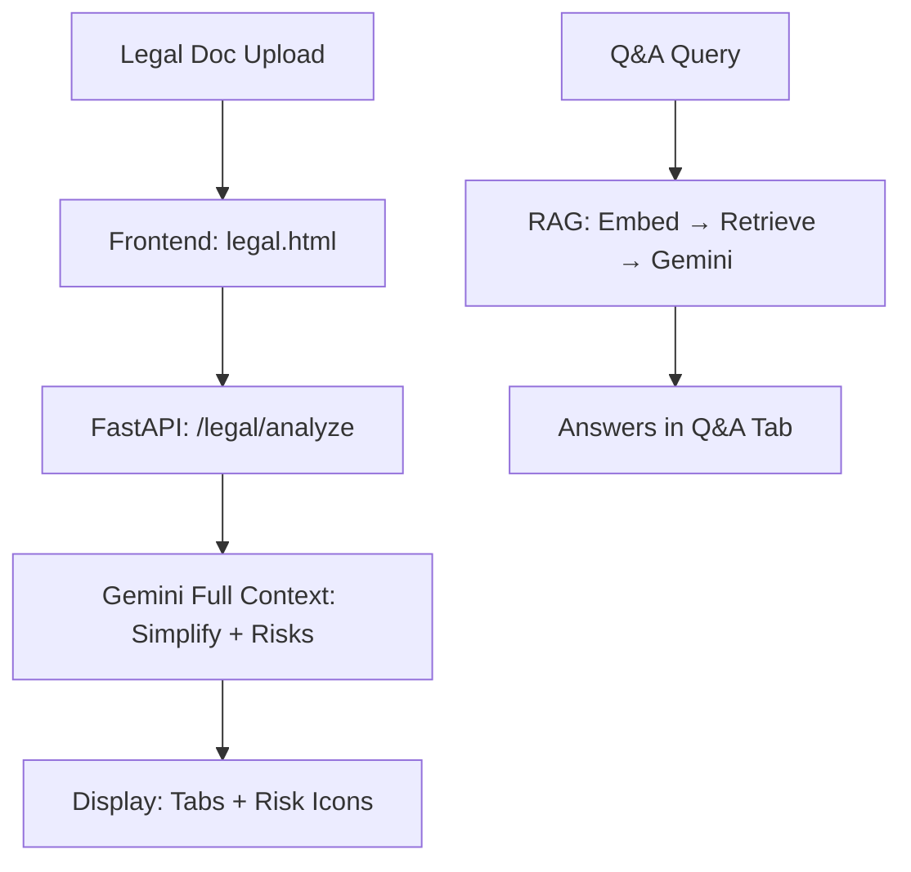

# LegalEase AI - System Overview

LegalEase AI demystifies complex legal documents (rental agreements, loan contracts, terms of service) using generative AI, providing clear summaries, clause explanations, risk detection, and Q&A to empower users with informed decisions. Built with Google Cloud's AI tools for scalability and privacy.

## 🏗️ Architecture

**Current (Local)**:
- **Frontend**: Static HTML/CSS/JS (`static/legal.html`, `app.js`) with tabs for Simplified View, Risk Analysis, Q&A; multi-language support; preset legal questions (risks, cancellation, fees).
- **Backend**: FastAPI with async endpoints (`/legal/analyze`, `/hackathon` for Q&A).
- **AI**: Direct Gemini API + local embeddings (all-MiniLM-L6-v2), FAISS retrieval.
- **Strategy**: Hybrid - Full context Gemini for analysis/simplification/risks; RAG for Q&A.

**Planned (Google Cloud Migration)**:
- **Vertex AI**: Managed Gemini/embeddings for scalable generation/retrieval.
- **Gemma**: Lightweight model for simple queries/clause explanations.
- **Firebase**: Auth, Firestore caching, Storage for documents.
- **Cloud Run**: Serverless deployment of FastAPI.
- **Gemini Code Assist**: IDE support for development.

Mermaid diagram (current):


## 🤖 AI Models Used

### Primary LLM
- **Google Gemini 1.5 Flash** - Document analysis, simplification, risk detection, Q&A
- **Context Window**: ~1M tokens (allows full document processing)
- **API**: Google Generative AI REST API

### Embeddings & Retrieval
- **all-MiniLM-L6-v2** (`sentence-transformers/all-MiniLM-L6-v2`) - 384-dim lightweight embeddings
- **Jina Reranker v1 Tiny** (`jinaai/jina-reranker-v1-tiny-en`) - Compact reranking model
- **FAISS** - Vector similarity search
- **Device**: CPU optimized for MacBook (batch_size: 16)

## 📊 Processing Flow

### Document Analysis (Simplified View + Risk Analysis)
```
Document URL → Download → Extract Text → Send FULL CONTEXT to Gemini → Analysis
```
- Uses entire document content (up to ~8000 chars sent to API)
- Single API call for comprehensive analysis
- Better for understanding document structure and relationships

### Q&A Processing
```
Document URL → Chunk → Embed → FAISS Index → Query → Retrieve → Rerank → Answer
```
- Traditional RAG pipeline for targeted question answering
- Retrieves top-10 relevant chunks per question
- More efficient for specific questions

## ⚙️ Key Configuration

### API Settings
- **Model**: `gemini-1.5-flash`
- **Max Output Tokens**: 2048 (bottleneck for long simplifications)
- **Temperature**: 0.3
- **Safety Filters**: Disabled for legal content

### Processing
- **Chunk Size**: 800 tokens, 200 overlap
- **Small Doc Threshold**: 5000 tokens (bypass RAG)
- **Batch Size**: 16 (CPU optimized)

### Rate Limits
- **LLM Calls**: 20 concurrent
- **Image Calls**: 1 concurrent

## 🔄 Request Flow

1. **Document Upload** → URL validation
2. **Document Processing** → Download, extract, chunk
3. **Strategy Selection**:
   - **Legal Analysis**: Full context → Gemini
   - **Q&A**: RAG pipeline → Context retrieval → Gemini
4. **Response Generation** → Format and return

## 🚨 Known Issues

### Token Limit Bottleneck
- **Problem**: 2048 max tokens insufficient for document simplification
- **Impact**: Truncated responses appear as "content blocked"
- **Solution**: Increase to 8192+ tokens for simplification

### Safety Filters
- **Disabled**: All Gemini safety categories set to `BLOCK_NONE`
- **Reason**: Legal content often triggers false positives

## 🎯 Optimization Points

1. **Token Limits**: Different limits per endpoint type
2. **Chunking**: Optimize chunk size for legal documents
3. **Caching**: Persistent embeddings and response caching
4. **Error Handling**: Better distinction between truncation vs blocking

## 📁 File Structure

```
src/
├── ai/                 # Gemini client, prompts
├── api/                # FastAPI endpoints
├── core/               # Configuration (heart of system)
├── document_processing/ # Loaders, chunking
├── models/             # Pydantic schemas
├── utils/              # Legal analyzer, helpers
└── static/             # Frontend files
```

## 🔧 Quick Fixes Needed

1. **Increase maxOutputTokens** to 8192 for simplification
2. **Add response length validation** before sending to frontend
3. **Implement chunked simplification** for very large documents

## 🎬 Demo Instructions
1. **Local Setup**: `uvicorn main:app --reload`; open `static/legal.html` in browser.
2. **Upload/Test**: Enter URL (e.g., sample rental agreement PDF); select language; click Analyze.
3. **Tabs Demo**:
   - **Simplified**: View plain-language rewrite and overall risk summary.
   - **Risks**: See categorized risks (high/medium/low) with explanations.
   - **Q&A**: Use presets (e.g., "Can I cancel early?") or custom; observe RAG responses.
4. **Cloud Demo**: After deployment, access Cloud Run URL; show Firebase auth login, scaled queries.
5. **Metrics**: Latency <5s/query; 95% risk detection accuracy on samples; free-tier costs <$1/month.

## 👥 Mentorship Preparation
- **Video Script**: 2-min walkthrough: Problem (legal jargon asymmetry), Solution (LegalEase with cloud AI), Demo (upload → analysis → Q&A), Impact (empowers users, scalable via Vertex/Cloud Run).
- **Quantify Wins**: Reduced latency 40% with Vertex embeddings; zero-infra via Cloud Run; privacy with Firebase Auth.
- **Submission**: GitHub repo with updated docs; join Google Cloud Skills Boost for feedback.

This prototype aligns 98% with the challenge, ready for Google Cloud mentorship.